# 📖 Triage Lite: Ultimate Help Icons & Code-Level Runbook

This comprehensive audit details every interactive help screen, onboarding runbook, and guide popup in the **Triage Lite** platform, mapping each directly to its **actual code-level functions, validation logic, and storage tables** in `src/App.tsx`.

To make this manual fully accessible, all industry-standard terminology has been translated into plain, real-world language:
*   **Kanban Columns** ➡️ **Interactive Task Lists** (To Do, Doing, Done list columns).
*   **Cards** ➡️ **Task Widgets** (representing a single physical unit of work, research, or study).
*   **Pomodoro Timer** ➡️ **Study/Focus Session Stopwatches and Break Timers**.
*   **Haptics** ➡️ **Physical Device Vibrations and Tactical Buzzes**.

---

## 🗺️ Triage Lite Help System Map

This flowchart maps how help menus are accessed and where they are physically rendered inside the application.

```mermaid
graph TD
    A["📱 App Main Header Settings Menu"] -->|Taps ⚙️ Settings| B("⚙️ Settings Menu Help")
    
    C["🎛️ Main Dashboard Board Columns"] -->|Taps ❓ Icon next to lists| D("❓ Dashboard Quick Runbook")
    
    E["🗂️ Task Card Details Overlay"] -->|Taps ❓ Icon on Card| F("📋 Card Edit Suite Runbook")
    E -->|Click Alarms Section| G("⏰ Alert Notifications Guide")
    E -->|Click Docs Section| H("📁 Document & Resource Guide")
    E -->|Click Receipts Section| I("🧾 Receipts Association Guide")
    
    J["📊 Focus Logs Overlay"] -->|Taps ❓ Icon| K("ℹ️ How Study Logs Work Guide")
    
    L["🎙️ Verbal Diary Reflection Modal"] -->|Taps ❓ Icon| M("🎙️ Daily Journal Quick Help")
    
    N["🧾 Business Receipts Modal"] -->|Taps ❓ Icon| O("🧾 Business Receipts Help")
    
    P["⏱️ Standalone Pomodoro Screen"] -->|Taps ❓ Icon| Q("🍅 Standalone Pomodoro Runbook")
    
    R["🏷️ Custom Label Studio Modal"] -->|Taps ❓ Icon| S("🏷️ Board Classification Runbook")
```

---

## 📋 Comprehensive Directory of Help Icons

### 1. ⚙️ Settings Menu Runbook
*   **Trigger Code Variable**: `isMenuHelpOpen`
*   **Page Location**: App HeaderSettings Menu Modal.
*   **Real-World Translation**: **"App Control Center & Backup Settings"**

#### 🛠️ Code-Level Functions & Real-World Operation Guide:
1.  **Export Data Backup**
    *   *Code Function*: `handleExportCSV()` (Lines 1086–1100).
    *   *What it does*: Gathers every single task card on your board and formats its details (ID, active list column, task title, summary, total focused seconds, and due date milestones) into a neat spreadsheets table.
    *   *How to operate*: Tap the **💾 Export Data Backup** button. Your browser/device will immediately download an Excel-compatible file named `${id}_tasks_export.csv`.
2.  **Apple iCloud Synchronization**
    *   *Code Function*: `syncData()` router.
    *   *What it does*: Coordinates cross-device saving. Tapping sync pushes your active cards, labels, and settings into Apple's CloudKit background synchronization framework.
    *   *How to operate*: Toggle the iCloud switch. All task lists will automatically match across your iPhone, iPad, and Mac.
3.  **Board Label Studio**
    *   *Code Functions*: `saveLabels()`, `setEditingLabelId()` (Lines 600–650).
    *   *What it does*: Your category tag creator. Updates your SQLite database category table (`factory_app_${id}_labels`) with custom categories.
    *   *How to operate*: Tap **🏷️ Board Label Studio**. Type a category name (e.g. "URGENT"), pick a visual highlight color, and click Save. These category tags will instantly be available to color-code your cards.
4.  **Feature Diagnostics**
    *   *Code Functions*: Mobile hardware triggers (e.g., `triggerHaptic()`, checking `SpeechRecognition.requestPermissions()`).
    *   *What it does*: Hardware-level sweeps to confirm your mobile phone is fully compatible with advanced features.
    *   *How to operate*: Tap **⚡ Feature Diagnostics**. The app runs background checks to verify if microphone transcription, calendar schedules, and touch haptic buzzes are supported.

---

### 2. ❓ Board Columns Quick Runbook
*   **Trigger Code Variable**: `isDashboardHelpOpen`
*   **Page Location**: Board Columns (To Do, Doing, Done list header rows).
*   **Real-World Translation**: **"Interactive Task Lists & Navigation Board"**

#### 🛠️ Code-Level Functions & Real-World Operation Guide:
1.  **Board Columns (Lists)**
    *   *Code State*: `lists` and `cards` arrays.
    *   *What it does*: Organizes task widgets into three columns: **TO DO** (pending work), **DOING** (active focus), and **DONE** (completed jobs). Displays active counters of how many items are in each list.
    *   *How to operate*: Simply view the board columns to see where your task widgets stand.
2.  **Mobile Column Navigation**
    *   *Code Logic*: Touch swipe event listeners & `activeListIndex` state.
    *   *What it does*: Allows sliding navigation on mobile devices.
    *   *How to operate*: On your phone screen, **swipe left or right** to slide lists into view, or tap the circular pagination dots at the top to slide directly to a list.
3.  **Card Interaction (Creating & Selecting)**
    *   *Code Functions*: `setSelectedCardForEdit(card)` and column-specific Card Creation handlers.
    *   *What it does*: Opens a detailed editor or generates a new task card.
    *   *How to operate*: Tap any task card's frame to edit details. Tap the orange **+** icon inside a column header to create a new task card inside that specific list.
4.  **Moving Cards**
    *   *Code Function*: `handleReorderCard(draggedId, targetId)` (Lines 1043–1065) & `MOVE ▾` buttons.
    *   *What it does*: Shakes up task lists and relocates task widgets.
    *   *How to operate*: On desktop computers, **click and drag** a card directly to another list. On mobile screens, tap the orange `MOVE ▾` button on the card face and select a column destination.
5.  **Spent Timer & Progress Indicators**
    *   *Code Logic*: `card.timeSpent` counters & checklist item completion ratios.
    *   *What it does*: Tracks card-specific study clocks and renders sub-task completion bars (e.g., "3 of 5 sub-tasks done").
    *   *How to operate*: Automatic! The card covers automatically display active times and task completion progress as you check items off.

---

### 3. 📋 Card Edit Suite Runbook
*   **Trigger Code Variable**: `isCardHelpOpen`
*   **Page Location**: Detailed Card Editor (Tapping any task card ➡️ Tapping the **❓** next to the title).
*   **Real-World Translation**: **"Task Widget Settings Editor"**

#### 🛠️ Code-Level Functions & Real-World Operation Guide:
1.  **Label Manager**
    *   *Code State*: `card.labelIds` selection array and `saveCards()`.
    *   *What it does*: Applies color-coded category tags to a task widget.
    *   *How to operate*: Tap category checkmarks to instantly display colored visual tags on your task cards.
2.  **Task Summary (Validation)**
    *   *Code Validation*: Blocks save action if the main summary text box is empty, triggering a haptic warning toast.
    *   *What it does*: Ensures task integrity.
    *   *How to operate*: Type in the description field. If you erase the description and attempt to save, the app will block the save and alert you.
3.  **Pomodoro Timer**
    *   *Code Logic*: Tracks card study clocks and appends sessions to `card.studySessions` array.
    *   *What it does*: Measures how long you've focused on this specific task.
    *   *How to operate*: Tap the play icon next to the card clock to start a study focus timer.
4.  **Deadline & Time**
    *   *Code State*: `card.dueDate` date picker.
    *   *What it does*: Anchor milestone deadlines for scheduled alerts.
    *   *How to operate*: Tap the date/time box to choose your deadline day.
5.  **Research Citations**
    *   *Code Validation*: Enforces mutually inclusive link + title validations.
    *   *What it does*: Saves academic citations and online bibliography databases.
    *   *How to operate*: Paste an online citation URL. You must type a short title description, or the system will alert you that both are required.
6.  **Cloud Drives**
    *   *Code Logic*: Formats and checks file paths.
    *   *What it does*: Saves folders/files links on Google Drive, iCloud, or OneDrive.
    *   *How to operate*: Paste shared cloud links into the drive box to keep project files handy.

---

### 4. ⏰ Alarm Notifications Guide
*   **Trigger Code Variable**: `isAlertsHelpOpen`
*   **Page Location**: Card Editor Modal ➡️ Inside the **Alerts & Notifications** drawer.
*   **Real-World Translation**: **"Task Reminder Alarms"**

#### 🛠️ Code-Level Functions & Real-World Operation Guide:
1.  **Due Date Trigger (Prerequisite)**
    *   *Code Logic*: Restricts alarm access unless `card.dueDate` is active.
    *   *What it does*: Prevents empty alarms from being scheduled on your phone.
    *   *How to operate*: Select a due date first. This date is the anchor point for all reminder alerts.
2.  **Capacitor Local Push Alerts**
    *   *Code Function*: `LocalNotifications.schedule()` (Lines 343–370).
    *   *What it does*: Registers a background alarm on your phone's iOS/Android system.
    *   *How to operate*: Select a reminder interval. Alarms will fire even when your phone screen is locked or the app is closed.
3.  **Reminder Lead Time**
    *   *Code Logic*: Calculates alarm relative times (Due Time, 5 mins before, 15 mins before, 1 hour before, or 1 day before).
    *   *What it does*: Triggers reminders early.
    *   *How to operate*: Tap a lead-time selection (e.g. "15 mins before") to schedule an early reminder alert.

---

### 5. 🔔 Alert Studio Runbook
*   **Trigger Code Variable**: `isAlertStudioHelpOpen`
*   **Page Location**: Header Alarms Config overlay (Alert Studio).
*   **Real-World Translation**: **"Global Alarms Control Panel"**

#### 🛠️ Code-Level Functions & Real-World Operation Guide:
1.  **Due Date**: Task milestone targets.
2.  **In-App Toast**: Displays real-time on-screen banner notifications (`showToast`).
3.  **System Lock-Screen**: Native system-wide push alerts.
4.  **Calendar Sync**: Integrates tasks directly into your native phone calendar app (`CapacitorCalendar.createEvent()`).
5.  **Email Composer**: Automatically composes and pre-fills email reminders (`window.open("mailto:...")`).

---

### 6. 📁 Document & Resource Guide
*   **Trigger Code Variable**: `isDocsHelpOpen`
*   **Page Location**: Card Editor Modal ➡️ Inside the **Documents & Uploads** section.
*   **Real-World Translation**: **"File Attachments & Bibliography Manager"**

#### 🛠️ Code-Level Functions & Real-World Operation Guide:
1.  **Central Submission Portal (Uploads)**
    *   *Code Logic*: File picker with size validator (enforces max size limit of 1.5MB in `handleFileUpload`).
    *   *What it does*: Attaches static delivery items (PDFs, slides, Word documents).
    *   *How to operate*: Tap the upload field and select a file. The app will verify its size and link it directly to your task.
2.  **Bibliography & Citations CSV Export**
    *   *Code Function*: Citations CSV generator (Lines 3399–3405).
    *   *What it does*: Gathers citation sources and downloads them in a structured CSV list.
    *   *How to operate*: Click **📥 Export Citations** to download a spreadsheet file named `citations_${cardId}.csv`.

---

### 7. 🧾 Receipts Association Guide
*   **Trigger Code Variable**: `isReceiptsLinkHelpOpen`
*   **Page Location**: Card Editor Modal ➡️ Inside the **Business Claims & Receipts** section.
*   **Real-World Translation**: **"Receipts Linker & Budget Tracker"**

#### 🛠️ Code-Level Functions & Real-World Operation Guide:
1.  **Associate Expenses**
    *   *Code State*: Updates `receipts` state, linking `receipt.cardId` with active card ID.
    *   *What it does*: Maps logged financial expenditures to active task targets.
    *   *How to operate*: Tap the dropdown, choose a logged expense claim, and click "Link". The receipt details and snapped image previews will bind directly to your task.
2.  **SQLite Persistence**
    *   *Code Logic*: SQLite sync triggers (`factory_app_${id}_receipts`).
    *   *What it does*: Keeps linked mappings persistent across devices.
    *   *How to operate*: Automatic! Any link/unlink action is instantly synced to your local SQLite storage.

---

### 8. ℹ️ Study Focus Logs Guide
*   **Trigger Code Variable**: `isLogHelpOpen`
*   **Page Location**: Focus Logs & Session Timers overlay panel.
*   **Real-World Translation**: **"Timesheet History & Export Panel"**

#### 🛠️ Code-Level Functions & Real-World Operation Guide:
1.  **Active Focus Sorting**
    *   *Code Logic*: `cards.filter(c => c.timeSpent > 0).sort(...)` descending.
    *   *What it does*: Ranks tasks from most-focused to least-focused.
2.  **Active Target Checkboxes (Recalculator)**
    *   *Code Logic*: Reactive checkbox states linked to `uncheckedLogCardIds`.
    *   *What it does*: Recalculates total focus duration dynamically as you toggle items.
    *   *How to operate*: Tick/untick checkboxes next to task times to instantly update your focus total.
3.  **CSV Spreadsheet Export**
    *   *Code Function*: Focus Logs CSV generator (Lines 3935–3980).
    *   *What it does*: Compiles active focus logs into a formatted spreadsheet.
    *   *How to operate*: Tapping **📥 Export CSV** downloads a structured sheet named `triage_focus_session_logs_${Date.now()}.csv`.
4.  **Email & Clipboard Backup**
    *   *Code Function*: Copies focus logs text to device clipboard (`navigator.clipboard.writeText`) and initiates pre-filled email forms.
    *   *How to operate*: Tap **📧 Share Log Report**. This copies your timesheet summary to your clipboard and opens your default mail client.

---

### 9. 🎙️ Daily Journal Quick Help Guide
*   **Trigger Code Variable**: `showDiaryHelp`
*   **Page Location**: Daily Reflections ➡️ **🎙️ Verbal Journal** bottom navigation tab.
*   **Real-World Translation**: **"Voice-to-Text Diary Timeline"**

#### 🛠️ Code-Level Functions & Real-World Operation Guide:
1.  **Dictate Note**
    *   *Code Functions*: `startDictation()`, `stopDictation()` (Lines 193–318).
    *   *What it does*: Transcribes speech into text using native mobile voice APIs.
    *   *How to operate*: Tap the red **🎙️ Start Recording** button, speak clearly, and tap stop to transcribe.
2.  **Auto Timestamps**
    *   *Code Logic*: Chronological voiceLog array mapping.
    *   *What it does*: Date-and-time stamps every verbal entry to compile a chronological work timeline.
3.  **Card Dispatching**
    *   *Code Function*: `dispatchLogToCard(logId, cardId)` (Lines 320–342).
    *   *What it does*: Prepends the verbal entry text to your selected card's description.
    *   *How to operate*: Pick a card from the orange dropdown menu and click Dispatch to attach your note directly to a task widget.

---

### 10. 🧾 Business Receipts Help Guide
*   **Trigger Code Variable**: `showReceiptsHelp`
*   **Page Location**: Business Reflections ➡️ **🧾 Receipts** bottom navigation tab.
*   **Real-World Translation**: **"Expense Capture & Reimbursement Logs"**

#### 🛠️ Code-Level Functions & Real-World Operation Guide:
1.  **Photo Snap (Camera)**
    *   *Code Function*: Capacitor Camera module (`Camera.getPhoto()`).
    *   *What it does*: Captures and logs images of purchase slips.
    *   *How to operate*: Tap **📸 Snap Receipt Photo** to take a picture of your expense.
2.  **Tamper-Proof Timestamps**
    *   *Code Logic*: Immutable date stamps during receipt creation.
    *   *What it does*: Audits exactly when purchase entries are captured.
3.  **Claim Costs**
    *   *Code Logic*: Form validations (Merchant name strings, decimal numbers).
    *   *What it does*: Enforces valid numbers for business claim costs.
    *   *How to operate*: Type the vendor name and numerical cost (e.g. 45.50) into the input boxes.

---

### 11. 💡 Standalone Pomodoro Runbook
*   **Trigger Code Variable**: `showTimerHelp`
*   **Page Location**: dedicated **🍅 Pomodoro** bottom navigation tab.
*   **Real-World Translation**: **"Focus Study & Break Clocks"**

#### 🛠️ Code-Level Functions & Real-World Operation Guide:
1.  **Work Session & Breaks**
    *   *Code Logic*: 25-min, 5-min, and 15-min countdown loops.
    *   *What it does*: Alternate focus and rest periods.
    *   *How to operate*: Tap Work (25m), Short Break (5m), or Long Break (15m), then tap Start to begin.
2.  **Native Notifications**
    *   *Code Function*: Capacitor local push triggers.
    *   *What it does*: Sounds alarms and vibrates your phone when a countdown is finished.

---

### 12. 💡 Board Classification Runbook
*   **Trigger Code Variable**: `showLabelHelp`
*   **Page Location**: **Board Categories / Label Studio** modal.
*   **Real-World Translation**: **"Category Tag Manager"**

#### 🛠️ Code-Level Functions & Real-World Operation Guide:
1.  **Categories & Palettes**
    *   *Code State*: Custom labels state list and color palettes.
    *   *What it does*: Defines customized category names and matches them with distinct colors.
    *   *How to operate*: Type a name (e.g. "WEEKLY"), pick a visual color, and click Save.
2.  **Assignment**
    *   *Code Logic*: Card card-to-labels mapping.
    *   *What it does*: Tags active tasks with category colors.
    *   *How to operate*: Open any task card, select category checkboxes, and view your card face instantly updated with those categories.

---

## 📊 Summary Quick Reference Table

| # | Help Page / Section Name | Trigger Variable | Core Code-Level Action | Real-World Operational Target |
|---|---|---|---|---|
| **1** | **Settings Menu** | `isMenuHelpOpen` | `handleExportCSV()`, `syncData()` | App settings, CSV data dumps, iCloud profiles |
| **2** | **Board Columns** | `isDashboardHelpOpen` | `handleReorderCard()`, swiping triggers | Main interactive list-columns dashboard |
| **3** | **Card Details Editor** | `isCardHelpOpen` | Description & citation validation locks | Card detailed configuration menu |
| **4** | **Card Alarm Panel** | `isAlertsHelpOpen` | `LocalNotifications.schedule()` | Lead-time reminders linked to due dates |
| **5** | **Alert Studio Dashboard** | `isAlertStudioHelpOpen` | `CapacitorCalendar.createEvent()`, toasts | Central alarms coordinator & router |
| **6** | **Card Documents Hub** | `isDocsHelpOpen` | `handleFileUpload()`, size verification | PDF attachments and academic citation files |
| **7** | **Card Receipts Tray** | `isReceiptsLinkHelpOpen` | Mappings update, SQLite synchronizer | Budget expenditure tracking per task |
| **8** | **Focus Session Logs** | `isLogHelpOpen` | Active checkbox recalculator, clipboard copy | study timesheet log histories & total times |
| **9** | **Verbal Diary Reflection**| `showDiaryHelp` | `startDictation()`, `dispatchLogToCard()` | Speech-to-text recorders & voice timeline logs |
| **10**| **Business Expense Claims** | `showReceiptsHelp` | `Camera.getPhoto()`, form text validators | Snapping receipt photos & tracking claim costs |
| **11**| **Standalone Timer Tab** | `showTimerHelp` | Countdown loops, finish buzzers | High-precision focus and break timers |
| **12**| **Custom Label Studio** | `showLabelHelp` | `saveLabels()`, `deleteLabel()` | Custom classification category tags |
