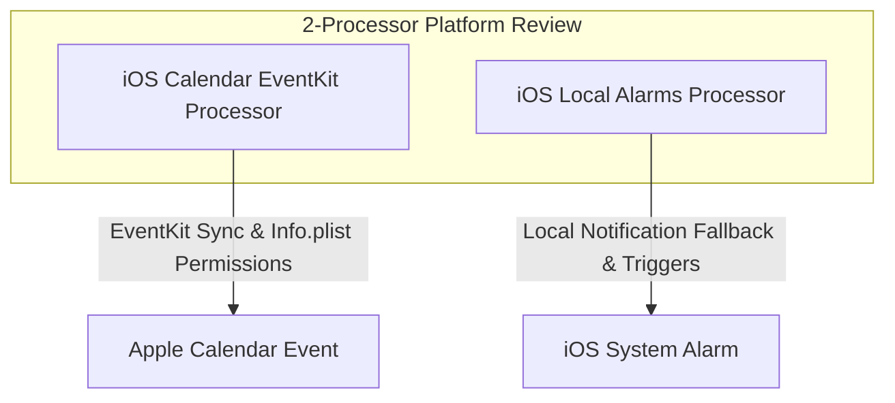

# 📋 2-Processor Plan: Native Apple Calendar Alarms & Reminders

This document outlines a premium system design to sync card due dates directly with the **Native Apple Calendar app** on iOS (via EventKit) and schedule native **local system alarms** (via Local Notifications), making Triage Lite incredibly sticky and interactive on the iPhone.

---

## 🧠 2-Processor Platform Investigation

We evaluate the native iOS calendar and alarm integration using 2 specialized processor perspectives:



### 1. 📅 iOS Calendar EventKit Processor (Apple Calendar Integration)
* **Goal:** Create actual, editable events inside the user's native Apple Calendar app on iOS whenever a due date is specified on a card.
* **Underlying Engine:** Utilizes the Capacitor Calendar plugin (`@capacitor-community/calendar`) which wraps Apple's native **EventKit** framework in Swift.
* **Security & Permissions (Critical for iOS App Store):**
  * To write events to Apple Calendar, we must declare the native description key in the Xcode workspace (`Info.plist`):
    ```xml
    <key>NSCalendarsUsageDescription</key>
    <string>Triage Lite requires calendar access to sync card due dates with your Apple Calendar and schedule alerts.</string>
    ```
* **API Handshake (Swift Wrapper):**
  ```typescript
  import { Calendar } from '@capacitor-community/calendar';

  const syncToAppleCalendar = async (card: Card) => {
    if (!card.dueDate) return;

    // 1. Request calendaring permissions from iOS
    const permission = await Calendar.requestPermission();
    if (permission.result !== 'granted') return;

    // 2. Schedule Event (set to 1 hour duration starting at local midnight/due time)
    const startDate = new Date(card.dueDate);
    const endDate = new Date(card.dueDate + 60 * 60 * 1000); // 1 hour duration

    await Calendar.createEvent({
      title: `📌 [Triage Lite] ${card.title}`,
      notes: card.description || 'Synced from Triage Lite mobile app.',
      startDate: startDate.toISOString(),
      endDate: endDate.toISOString(),
      alarms: [
        { offset: -15 } // Set native Apple Calendar alert 15 minutes before due time!
      ]
    });
  };
  ```

### 2. ⏰ iOS Local Alarms Processor (Push Notification Fallback)
* **Goal:** Set a guaranteed system-level alert banner/sound at the exact due date timestamp, without requiring the user to open their Apple Calendar app.
* **Underlying Engine:** Uses `@capacitor/local-notifications` to schedule high-priority OS-level alert banners with haptic vibration feedback.
* **API Handshake:**
  ```typescript
  import { LocalNotifications } from '@capacitor/local-notifications';

  const scheduleLocalAlarm = async (card: Card) => {
    if (!card.dueDate) return;

    // Request permissions
    await LocalNotifications.requestPermissions();

    // Schedule native alarm
    await LocalNotifications.schedule({
      notifications: [
        {
          id: parseInt(card.id.replace(/\D/g, '')) || Date.now(), // Generate numerical ID
          title: "⏰ Triage Task Due Now!",
          body: `"${card.title}" has reached its scheduled due date!`,
          schedule: { at: new Date(card.dueDate) },
          sound: 'default',
          actionTypeId: 'OPEN_CARD',
          extra: { cardId: card.id }
        }
      ]
    });
  };
  ```

---

## 🛠️ Combined App.tsx Logic Integration

When a user edits a card's due date in the Brutalist Modal, saving it automatically initiates background syncs to both **iCloud/Local Storage** and schedules the **Native iOS alarms/calendar events**:

```typescript
const handleSaveCardDetails = async (updatedCard: Card) => {
  // 1. Update React Local state
  const updatedCards = cards.map(c => c.id === updatedCard.id ? updatedCard : c);
  await saveCards(updatedCards);

  // 2. Trigger native iOS calendar & notification systems if running natively
  if (isNative && updatedCard.dueDate) {
    try {
      // Schedule guaranteed alarm
      await scheduleLocalAlarm(updatedCard);
      
      // Optional: Add to Apple Calendar
      await syncToAppleCalendar(updatedCard);
      
      await triggerHaptic();
    } catch (e) {
      console.error("iOS system integrations failed: ", e);
    }
  }
};
```

---

## 📅 Verification & Validation Checklist

1. **Permission Gating:** Ensure that if the user blocks iOS Calendar permissions, the app fails gracefully without crashing, falling back to standard in-app notifications.
2. **Duplicate Prevention:** Before creating an event, the system should check if an event with that card's title/ID already exists in EventKit and update/replace it instead of creating duplicate calendar entries.
3. **Overdue Safeguard:** If the selected due date is in the past, bypass scheduling local alarms/notifications to avoid spamming the user immediately.
