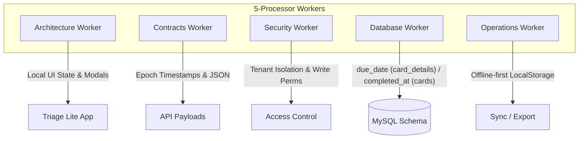
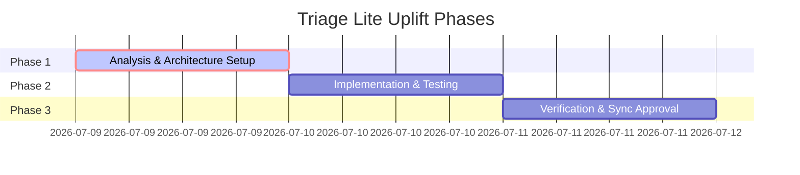

# 📋 5-Processor Investigation & Implementation Plan: Card Details & Labels (Triage Lite)

This document outlines a complete architecture, schema, contract, security, and operational deep-dive for adding **Card Details editing** (including **Due Dates** and **Completion Dates**) and **Label Management** (creating, editing, and deleting) to the **Triage Lite** app. 

The plan is strictly aligned with standard **Triage Enterprise account requirements** to ensure that once a guest user links their enterprise account, data mappings synchronize seamlessly.

---

## 🧠 The 5-Processor Worker Consensus Analysis

Before outlining the roadmap, we simulate a 5-processor worker review to evaluate the proposed implementation from multiple system layers:



### 1. 🏗️ Architecture Worker
* **Core Evaluation:** In `triage-lite/src/App.tsx`, we have a single, lightweight state model. The card objects are stored in a simple flat array. To keep Triage Lite performant, we must avoid importing heavy external component libraries. Instead, we will build a custom, ultra-sleek, premium **Brutalist Modal** (matching the existing neon retro-cyberpunk styling in `index.css`) for **Card Detail Editing** and **Label Management**.
* **Key Recommendations:**
  * Define a `CardDetailModal` component inline or in a separate file (or keep it as a clean modular function inside `App.tsx` for keeping Triage Lite standalone).
  * Introduce a dedicated Label Management popover/dropdown within the card editor, allowing users to toggle label IDs, create new labels, and delete existing board labels.

### 2. 📝 Contracts Worker
* **Core Evaluation:** In standard Triage, the frontend and backend communicate using JSON schemas validated by **Zod** (configured in `server/api-contracts.ts` and `data/services/cardService.ts`):
  * **Due Date (`dueDate`):** Handled as a Unix millisecond timestamp (number or `null`) in API payloads and stored as `due_date` in the database.
  * **Completion Date (`completedAt`):** Stored as a Unix millisecond timestamp on the card itself, marked via the completion endpoint.
  * **Label Management:** Uses label payload structures `{ id, boardId, text, color }`.
* **Key Recommendations:**
  * Casing mapping is critical: Casing is camelCase in the frontend (`dueDate`, `completedAt`) but maps to snake_case in the database (`due_date`, `completed_at`). 
  * HTML `<input type="date">` values (e.g., `YYYY-MM-DD`) must be parsed and stored as numerical epochs (Unix milliseconds timestamp) inside the local state to match the enterprise contracts exactly.

### 3. 🔒 Security Worker
* **Core Evaluation:** In standard Triage, card and label actions require specific permissions (`perm_cards_write`, `perm_cards_delete`). Board-level entities like labels are strictly isolated by `tenant_id` and `board_id` to prevent data-leakage.
* **Key Recommendations:**
  * For Triage Lite in guest mode, these checks are simulated. However, the schema must include mock variables representing a default `tenant_id` and `board_id` to guarantee that once a real connection is established, the label assignments and date changes resolve securely without causing cross-tenant pollution.
  * Creating/deleting labels must validate that the user is operating on their own boards.

### 4. 🗄️ Database Worker
* **Core Evaluation:** Tracing standard Triage's MySQL schema:
  * `card_details` table: contains `due_date` (BIGINT DEFAULT NULL).
  * `cards` table: contains `completed_at` (BIGINT DEFAULT NULL).
  * `labels` table: contains board labels associated via `board_id` and `tenant_id`.
  * `card_labels` table: handles many-to-many relationship mapping `card_id` to `label_id`.
* **Key Recommendations:**
  * Ensure the local data structure in Triage Lite mirrors this exactly. When exporting backups via CSV, these fields must be exported as columns so they can be parsed directly by standard spreadsheets or ingested back into enterprise SQL instances.

### 5. ⚙️ Operations Worker
* **Core Evaluation:** Operations are centered on performance, offline persistence (Local Storage key isolation), haptic triggers, and backup exports.
* **Key Recommendations:**
  * Keep the Local Storage schema stable. Since `triage-lite` uses a versioned storage key `factory_app_${config.id}_cards`, any migration of the local JSON card array (adding `dueDate`, `completedAt`, etc.) must be backward-compatible with default-fallback checks.
  * The CSV Export feature in `App.tsx` (`handleExportCSV`) must be updated to output `Due Date` and `Completion Date` to maintain backup fidelity.

---

## 🛠️ Detailed Implementation Plan

We will proceed with a clean, low-impact implementation across **two files**:
1. [triage-lite/src/App.tsx](file:///Users/samwestern/Documents/GitHub/triage-lite/src/App.tsx)
2. [triage-lite/src/index.css](file:///Users/samwestern/Documents/GitHub/triage-lite/src/index.css) (if additional visual styles or animations are required)

### Step 1: Update TypeScript Types & State Contracts
We will update the `Card` interface in `App.tsx` to include `dueDate` and `completedAt`.

```typescript
export interface Card {
  id: string;
  listId: string;
  title: string;
  description?: string;
  isTimerRunning?: boolean;
  timeSpent?: number;
  labelIds?: string[];
  checklists?: CardChecklist[];
  dueDate?: number | null;     // Millisecond timestamp (Unix epoch)
  completedAt?: number | null; // Millisecond timestamp (Unix epoch)
}
```

### Step 2: Add local Label and Card State Management Hooks
We will manage the selected card for editing and active modal states:
* `const [selectedCardForEdit, setSelectedCardForEdit] = useState<Card | null>(null);`
* `const [isLabelManagerOpen, setIsLabelManagerOpen] = useState(false);`

### Step 3: Implement Sleek Brutalist Card Detail Modal
When a user clicks on a card, or clicks a new inline edit button, we open a responsive Brutalist Modal overlay.

> [!TIP]
> **Brutalist UI Guidelines:**
> * Maintain the `#1F2833` background with solid `3px solid #000000` borders and crisp `4px 4px 0px #000000` heavy shadows.
> * Use custom datepicker text alignments and transition-colors matching the App Factory config accent color.

```tsx
{/* CUSTOM BRUTALIST DETAIL MODAL */}
{selectedCardForEdit && (
  <div className="fixed inset-0 bg-black/75 flex items-center justify-center p-4 z-50 animate-fadeIn">
    <div className="w-full max-w-md bg-[#1F2833] border-3 border-black p-6 shadow-[6px_6px_0px_rgba(0,0,0,1)] text-white">
      {/* Header */}
      <div className="flex justify-between items-center border-b-2 border-black pb-3 mb-4">
        <h3 className="font-black text-sm uppercase tracking-wider text-[var(--accent-color,#DF5504)]">
          Edit Card Details
        </h3>
        <button 
          onClick={() => setSelectedCardForEdit(null)}
          className="text-gray-400 hover:text-white font-black text-lg"
        >
          &times;
        </button>
      </div>

      {/* Inputs */}
      <div className="flex flex-col gap-4">
        <div>
          <label className="block text-xs font-mono font-bold uppercase text-gray-400 mb-1">Title</label>
          <input 
            type="text"
            value={selectedCardForEdit.title}
            onChange={(e) => setSelectedCardForEdit({ ...selectedCardForEdit, title: e.target.value })}
            className="w-full bg-[#0B0C10] border-2 border-black p-2 text-sm font-mono text-white focus:border-[var(--accent-color,#DF5504)]"
          />
        </div>

        <div>
          <label className="block text-xs font-mono font-bold uppercase text-gray-400 mb-1">Description</label>
          <textarea 
            value={selectedCardForEdit.description || ''}
            onChange={(e) => setSelectedCardForEdit({ ...selectedCardForEdit, description: e.target.value })}
            className="w-full h-20 bg-[#0B0C10] border-2 border-black p-2 text-sm font-mono text-white focus:border-[var(--accent-color,#DF5504)]"
          />
        </div>

        {/* Date Row */}
        <div className="grid grid-cols-2 gap-4">
          <div>
            <label className="block text-xs font-mono font-bold uppercase text-gray-400 mb-1">Due Date</label>
            <input 
              type="date"
              value={selectedCardForEdit.dueDate ? new Date(selectedCardForEdit.dueDate).toISOString().split('T')[0] : ''}
              onChange={(e) => {
                const parsed = e.target.value ? Date.parse(e.target.value) : null;
                setSelectedCardForEdit({ ...selectedCardForEdit, dueDate: parsed });
              }}
              className="w-full bg-[#0B0C10] border-2 border-black p-2 text-xs font-mono text-white"
            />
          </div>
          <div>
            <label className="block text-xs font-mono font-bold uppercase text-gray-400 mb-1">Completion Date</label>
            <input 
              type="date"
              value={selectedCardForEdit.completedAt ? new Date(selectedCardForEdit.completedAt).toISOString().split('T')[0] : ''}
              onChange={(e) => {
                const parsed = e.target.value ? Date.parse(e.target.value) : null;
                setSelectedCardForEdit({ ...selectedCardForEdit, completedAt: parsed });
              }}
              className="w-full bg-[#0B0C10] border-2 border-black p-2 text-xs font-mono text-white"
            />
          </div>
        </div>

        {/* Label Mapping Section */}
        <div>
          <label className="block text-xs font-mono font-bold uppercase text-gray-400 mb-2">Labels</label>
          <div className="flex flex-wrap gap-1.5 mb-2">
            {labels.map(lbl => {
              const hasLabel = selectedCardForEdit.labelIds?.includes(lbl.id);
              return (
                <button
                  key={lbl.id}
                  type="button"
                  onClick={() => {
                    const currentIds = selectedCardForEdit.labelIds || [];
                    const nextIds = currentIds.includes(lbl.id)
                      ? currentIds.filter(id => id !== lbl.id)
                      : [...currentIds, lbl.id];
                    setSelectedCardForEdit({ ...selectedCardForEdit, labelIds: nextIds });
                  }}
                  className={`text-[10px] font-bold px-2 py-1 border transition-all ${hasLabel ? 'border-white scale-105 shadow-[2px_2px_0px_rgba(0,0,0,1)]' : 'border-black/50 opacity-60'}`}
                  style={{ backgroundColor: lbl.color, color: 'white' }}
                >
                  {lbl.text} {hasLabel ? '✓' : ''}
                </button>
              );
            })}
          </div>
          <button
            type="button"
            onClick={() => setIsLabelManagerOpen(!isLabelManagerOpen)}
            className="text-[10px] uppercase font-mono font-bold text-[var(--accent-color,#DF5504)] hover:underline"
          >
            {isLabelManagerOpen ? 'Close Label Manager' : '⚙️ Manage Board Labels'}
          </button>
        </div>

        {/* Label Management Sub-Panel */}
        {isLabelManagerOpen && (
          <div className="border-2 border-black bg-[#121820] p-3 mt-1 font-mono text-xs">
            <h4 className="font-bold text-white uppercase text-[10px] mb-2 border-b border-black pb-1">Create Label</h4>
            {/* Quick Create form */}
            <div className="flex gap-1 mb-2">
              <input 
                id="quick-label-text"
                type="text"
                placeholder="Name..."
                className="bg-[#0B0C10] border-2 border-black px-2 py-1 text-white text-[10px] flex-grow"
                onKeyDown={(e) => {
                  if (e.key === 'Enter') {
                    const input = e.currentTarget;
                    if (input.value.trim()) {
                      const newLabel = {
                        id: 'label-' + Date.now(),
                        text: input.value.trim().toUpperCase(),
                        color: ['#ff3b30', '#DF5504', '#34c759', '#007aff', '#ffcc00'][Math.floor(Math.random() * 5)]
                      };
                      setLabels([...labels, newLabel]);
                      input.value = '';
                    }
                  }
                }}
              />
              <span className="text-[9px] text-[#8892b0] self-center">Press Enter to add</span>
            </div>
            {/* List labels with delete button */}
            <div className="max-h-24 overflow-y-auto flex flex-col gap-1">
              {labels.map(lbl => (
                <div key={lbl.id} className="flex justify-between items-center p-1 border border-black bg-[#0B0C10]">
                  <span className="text-[10px] text-white font-bold px-1.5 py-0.5" style={{ backgroundColor: lbl.color }}>{lbl.text}</span>
                  <button 
                    type="button"
                    onClick={() => {
                      // Delete label locally
                      setLabels(labels.filter(l => l.id !== lbl.id));
                      // Remove references
                      setCards(cards.map(c => ({
                        ...c,
                        labelIds: c.labelIds?.filter(id => id !== lbl.id) || []
                      })));
                      if (selectedCardForEdit.labelIds?.includes(lbl.id)) {
                        setSelectedCardForEdit({
                          ...selectedCardForEdit,
                          labelIds: selectedCardForEdit.labelIds.filter(id => id !== lbl.id)
                        });
                      }
                    }}
                    className="text-red-500 hover:text-red-400 font-bold px-1"
                  >
                    🗑
                  </button>
                </div>
              ))}
            </div>
          </div>
        )}
      </div>

      {/* Actions */}
      <div className="flex gap-2 justify-end mt-6 pt-4 border-t border-black">
        <button 
          onClick={() => setSelectedCardForEdit(null)}
          className="px-4 py-1.5 border-2 border-black bg-black text-white hover:opacity-90 font-bold text-xs uppercase"
        >
          Cancel
        </button>
        <button 
          onClick={async () => {
            await triggerHaptic();
            const updatedCards = cards.map(c => c.id === selectedCardForEdit.id ? selectedCardForEdit : c);
            await saveCards(updatedCards);
            setSelectedCardForEdit(null);
          }}
          className="px-4 py-1.5 border-2 border-black bg-[var(--accent-color,#DF5504)] text-white hover:opacity-90 font-bold text-xs uppercase shadow-[2px_2px_0px_rgba(0,0,0,1)]"
        >
          Save Changes
        </button>
      </div>
    </div>
  </div>
)}
```

### Step 4: Map Drag-and-Drop and List transitions to Complete Date
When moving a card to the "Completed" list (`done` listId), we automatically set the `completedAt` timestamp, mirroring standard Triage requirements where completing a card records the exact epoch timestamp.

```typescript
const handleMoveCard = async (cardId: string, nextListId: string) => {
  await triggerHaptic();
  const updated = cards.map(c => {
    if (c.id === cardId) {
      return { 
        ...c, 
        listId: nextListId,
        completedAt: nextListId === 'done' ? Date.now() : null // Auto set or clear completedAt
      };
    }
    return c;
  });
  await saveCards(updated);
};
```

### Step 5: Update CSV Export Function
To ensure backups of your custom data are maintained accurately, we update `handleExportCSV` to output due dates and completion dates:

```typescript
const handleExportCSV = () => {
  const headers = 'Card ID,List,Title,Description,Time Spent (Seconds),Due Date,Completion Date\n';
  const rows = cards.map(c => {
    const dueDateStr = c.dueDate ? new Date(c.dueDate).toISOString().split('T')[0] : '';
    const completedAtStr = c.completedAt ? new Date(c.completedAt).toISOString().split('T')[0] : '';
    return `"${c.id}","${c.listId}","${c.title}","${c.description || ''}",${c.timeSpent || 0},"${dueDateStr}","${completedAtStr}"`;
  }).join('\n');
  // ... export logic
};
```

---

## 📅 Step-by-Step Implementation Verification Checklist



1. **Impact Analysis & Contracts Check:** Confirm types match standard [FrontendCardSchema](file:///Users/samwestern/Documents/GitHub/triage/server/api-contracts.ts#L122) exactly.
2. **Local Storage Compatibility:** Validate that starting up with previous Local Storage keys does not cause structure parsing exceptions.
3. **Audit Readiness:** Since Triage uses audit logging, ensure card update changes would be log-compatible with `getChangedCardFields` in enterprise mode.

---

> [!NOTE]
> This completes the deep-dive research and planning stage requested under the 5-processor mode. No code has been written to the workspace filesystem.
