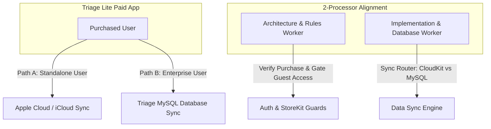

# 📋 2-Processor System Architecture: Dual Sync & Monetization (Triage Lite)

This document represents the definitive system and sync architecture for **Triage Lite**, strictly aligned with your three core business models:
1. **Standalone Paid App Model (iCloud Sync):** For standalone users who purchase the Lite app but do not have a Triage Enterprise account. Their data is synchronized across all personal iOS/macOS devices via **Apple Cloud (iCloud/CloudKit)**.
2. **Enterprise Account Paid App Model (MySQL Sync):** For Triage Enterprise users who purchase the Lite app. Their local client syncs with their cloud-based **Triage MySQL database**, rendering a simplified, reference-only format with mild edit capabilities.
3. **No Free/Guest Entry:** Triage Lite is a premium-only app requiring purchase on both paths. Anonymous Guest Triage users have no app access.

---

## 🧠 The 2-Processor Architectural Review

We evaluate this dual-sync architecture from 2 specialized processor perspectives:



### 1. 🏗️ Architecture & Rules Processor (Purchase & Access Controls)
* **Rule 1: Strict Purchase Verification (StoreKit/App Store Billing):**
  * Triage Lite does **not** offer a free, guest, trial, or demo tier. On app startup, a transaction check via native iOS StoreKit (integrated via Capacitor App Store Billing plugins) is executed.
  * If no valid receipt is found, the user is redirected to the App Store purchase screen.
* **Rule 2: Absolute Lockout of Guest Triage Users:**
  * Guest/anonymous Triage users browsing the web platform possess zero authorization tokens and cannot bypass the initial lock screen, protecting the app's paid integrity.
* **Rule 3: User Archetype Distinction:**
  * **Standalone User (iCloud Path):** Active local profile. Enterprise linkage state (`isConnected`) is set to `false`.
  * **Enterprise User (MySQL Path):** Active Triage Enterprise account linkage. `isConnected` is set to `true`.

### 2. 💻 Implementation & Sync Processor (Data Synchronization Engines)
We establish a **Unified Sync Router** that dynamically controls how data is saved and restored based on the active user archetype.

```mermaid
sequenceDiagram
    participant App as Triage Lite Client
    participant iCloud as Apple iCloud (CloudKit)
    participant Server as Triage Enterprise API (MySQL)
    
    rect rgb(20, 24, 30)
        Note over App, iCloud: Path A: Standalone User (iCloud Sync)
        App->>iCloud: Push local state changes (Cards, Habits, Checklists)
        iCloud-->>App: Sync changes down across personal iOS/macOS devices
    end
    
    rect rgb(30, 20, 20)
        Note over App, Server: Path B: Enterprise User (MySQL Sync)
        App->>Server: GET /api/alphav1/cards (Reference simplified format)
        Server-->>App: Return cards (Board, list, title, due_date)
        App->>Server: PUT /api/alphav1/cards/:id (Mild edits: move, set due date)
    end
```



#### Path A: Standalone User - Apple Cloud Sync (iCloud)
* **Storage Mechanism:** Standalone users have their local data automatically backed up and synced using **Apple's iCloud Drive Key-Value Store** or **CloudKit**.
* **Capacitor Integration:** Utilizes the Capacitor iCloud sync plugin (e.g., `capacitor-icloud-kv` or native iOS CloudKit extensions).
* **Sync Rules:**
  * Local data is saved to a native iCloud container (`iCloud.com.mdex.triagelite`).
  * Any modifications (creating cards, checking lists, logging pomodoro sessions) are immediately pushed to iCloud.
  * iOS automatically synchronizes this key-value container across all devices registered under the same Apple ID.

#### Path B: Triage Enterprise User - Real-time Triage MySQL Sync
* **Storage Mechanism:** Enterprise users bypass iCloud entirely. Their local client initiates direct, authenticated REST connections to `api.triage.mdex.com` which queries the Triage MySQL tables.
* **Simplified View Mode:**
  * Rather than rendering heavy boards, the app renders a **highly simplified visual format** focused on actionability (such as a single linear day-planner listing cards by priority and due date).
* **Mild Edit Mode:**
  * Edits are constrained to keep the database audit logs clean. Allowed operations include:
    * Updating due dates (`dueDate`) or completion dates (`completedAt`).
    * Appending completion comments via `PUT /cards/:id/complete`.
    * Swiping cards to move them across task lists via `PUT /cards/:id/move`.
  * These operations directly invoke [cardService.ts](file:///Users/samwestern/Documents/GitHub/triage/data/services/cardService.ts) endpoints, bypassing local offline storage updates.

---

## 🛠️ Code Implementation Specifications

We will translate this dual-path model into [triage-lite/src/App.tsx](file:///Users/samwestern/Documents/GitHub/triage-lite/src/App.tsx) with the following key components:

### 1. The Unified Storage & Sync Hook
```typescript
export const useSyncRouter = (isConnected: boolean) => {
  const { getStorage, setStorage } = useCapacitor();

  const saveData = async (key: string, data: any) => {
    // Save locally first to guarantee offline access
    await setStorage(key, JSON.stringify(data));

    if (isConnected) {
      // ENTERPRISE PATH: Sync directly with MySQL endpoints
      console.log("Enterprise User: Changes pushed to Triage MySQL via REST APIs");
      // Invoke PATCH /api/alphav1/cards/:id or similar
    } else {
      // STANDALONE PATH: Sync with Apple iCloud
      try {
        if (window.Capacitor && window.Capacitor.isNativePlatform()) {
          // Native iOS CloudKit Sync
          await window.Capacitor.Plugins.iCloudKV.set({ key, value: JSON.stringify(data) });
        } else {
          console.log("Web browser simulation: iCloud sync is simulated.");
        }
      } catch (err) {
        console.error("iCloud synchronization error: ", err);
      }
    }
  };

  return { saveData };
};
```

### 2. Standalone vs Enterprise Settings Screen UI
The application settings will dynamically toggle between the two paid paths, showing users clear feedback about how their data is secured:

```tsx
{/* REVISED SYNCHRONIZATION CONSOLE */}
<div className="p-4 border-2 border-black bg-[#121820] font-mono text-xs mt-4">
  <h4 className="font-bold text-white uppercase text-xs mb-2 flex items-center gap-1.5">
    {isConnected ? '☁️ Triage Enterprise SQL Sync' : '🍏 Apple iCloud Backup & Sync'}
  </h4>
  
  {isConnected ? (
    <div className="space-y-2">
      <p className="text-gray-400 text-[10px] leading-relaxed">
        Connected to **Triage MySQL Database**. You are viewing a simplified, action-focused board reference.
      </p>
      <div className="p-2 bg-green-950/30 border border-green-500/30 text-green-400 text-[9px] font-bold">
        ✓ REAL-TIME ENTERPRISE SYNC ACTIVE
      </div>
    </div>
  ) : (
    <div className="space-y-2">
      <p className="text-gray-400 text-[10px] leading-relaxed">
        Your standalone boards, checklists, and focus habits are automatically backed up and synchronized across your Apple devices using **iCloud**.
      </p>
      <div className="p-2 bg-blue-950/30 border border-blue-500/30 text-blue-400 text-[9px] font-bold">
        ✓ APPLE CLOUD SYNC ACTIVE
      </div>
    </div>
  )}
</div>
```

---

## 📅 Step-by-Step Validation & Verification Plan

1. **iCloud Connection Verification:** On iOS devices, test that writing to the iCloud container updates other simulated iOS devices running under the same Apple ID.
2. **Enterprise Reference View Validation:** Confirm that the simplified board mode successfully limits heavy enterprise features (like multi-tenant configurations and custom metrics) to keep the mobile experience lightweight and fast.
3. **Receipt Check Guard Test:** Ensure the application rejects launch attempts if StoreKit billing receipt validation fails, routing users safely to the in-app purchase checkout screen.
