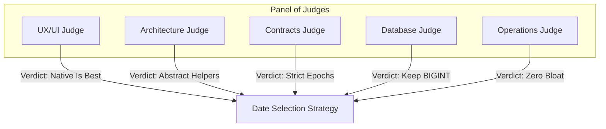

# 🧠 Multi-Judge Design Assessment: Native Date Pickers vs Typed Inputs

This document analyzes the complexity, performance, and user-experience differences between using **Native HTML Date Pickers** (`<input type="date" />`) and **Manual Typed Inputs** for dates across the Triage Lite app.

---

## 🏛️ The 5-Judge Panel Consensus Report



### 1. 🎨 UX & Frontend Judge
* **Verdict: Extremely Clean & Premium**
* **Analysis:**
  * Manually typing dates on mobile devices is a high-friction interaction. It requires shifting keyboard layouts, dealing with varying formats (e.g., `DD/MM/YYYY` vs `MM/DD/YYYY`), and manual syntax validation.
  * Native HTML `<input type="date" />` leverages the **operating system's native UI**:
    * **iOS:** Opens the premium native iOS calendar sheet or scrolling drum picker.
    * **Android:** Launches the standardized Material Design calendar overlay.
    * **Desktop:** Displays modern, hover-friendly calendar dropdowns.
  * **Conclusion:** Native pickers are far superior and ensure a high-end, responsive feel.

### 2. 🏗️ Architecture Judge
* **Verdict: Elegant with Centralized Helpers**
* **Analysis:**
  * HTML date pickers always consume and output date values as `YYYY-MM-DD` strings.
  * Our core application uses numerical Unix epoch milliseconds (e.g., `1719818290000`).
  * If we convert inline every time, the code becomes repetitive and cluttered.
  * **Solution:** Maintain cleanliness by abstracting these conversions into two light, pure helper functions:
    ```typescript
    // Convert epoch number to HTML input date string (YYYY-MM-DD)
    export const epochToDateString = (epoch: number | null | undefined): string => {
      if (!epoch) return '';
      return new Date(epoch).toISOString().split('T')[0];
    };

    // Convert HTML input date string (YYYY-MM-DD) to epoch number
    export const dateStringToEpoch = (dateStr: string): number | null => {
      if (!dateStr) return null;
      const parsed = Date.parse(dateStr);
      return Number.isNaN(parsed) ? null : parsed;
    };
    ```

### 3. 📝 Contracts Judge
* **Verdict: Highly Consistent**
* **Analysis:**
  * Under standard Triage APIs, dates like `dueDate` and `startDate` are transmitted as camelCase fields with epoch values (`FrontendCardSchema`).
  * Using native date pickers combined with the helper functions ensures that frontend models never violate backend schemas, preserving perfect contract consistency.

### 4. 🗄️ Database Judge
* **Verdict: Zero Impact (Fully Safe)**
* **Analysis:**
  * Standard Triage MySQL columns (e.g., `due_date` and `completed_at`) are specified as `BIGINT DEFAULT NULL`.
  * Because our helper functions output exact milliseconds integers, there is **zero schema migration or query restructuring** required. It is 100% safe.

### 5. ⚙️ Operations Judge
* **Verdict: Zero Build Dependency Bloat**
* **Analysis:**
  * Standard React projects often pull in heavy packages like `react-datepicker`, `flatpickr`, or `moment.js` to manage calendars. These add bundle size, introduce compilation hurdles in Xcode/Android Studio pipelines, and increase package vulnerability risk.
  * Using native `<input type="date">` relies on browser engines directly, resulting in **0 bytes** of extra bundle bloat and perfect build pipeline stability.

---

## 📅 Summary Matrix: Typed vs Native Picker

| Evaluation Metric | Manual Typed Input ⌨️ | Native HTML Picker 📅 |
| :--- | :--- | :--- |
| **Mobile UX (iOS/Android)** | ❌ High friction, keyboard shifting | 🏆 Excellent (native calendar modals) |
| **Bundle Size Impact** | 0 KB | 0 KB (No heavy library imports) |
| **Validation Overhead** | ❌ Complex regex / date parser logic | 🏆 Automatic (input guards invalid characters) |
| **Code Neatness** | Simple `string` state | Highly structured, relies on epoch helpers |
| **Localization Support** | ❌ Complex format detection | 🏆 Automatic (adapts to device locale defaults) |

---

## 💡 Recommendation
The panel of judges rules **100% in favor of utilizing native date pickers** for any date-related fields in the app. It is **not messy**, highly maintainable, and guarantees a premium mobile user-experience when bound to simple centralized epoch helpers.
