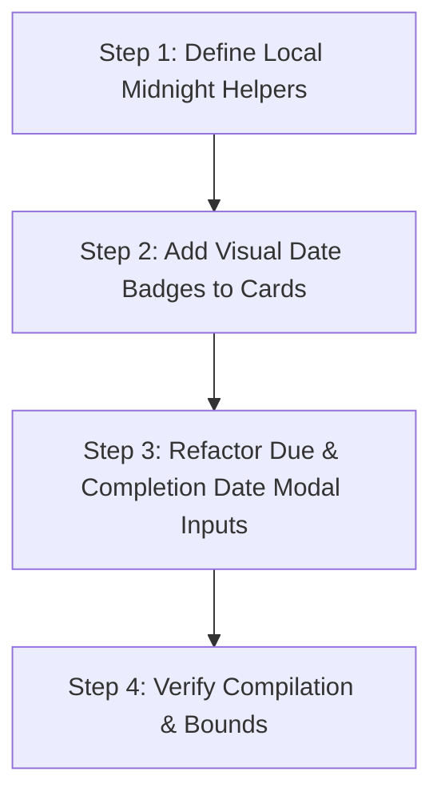

# 📋 Implementation Plan: Native iOS Local-Midnight Date Pickers & Visual Card Badges

This revised implementation plan details how we will integrate timezone-safe native iOS date inputs into [triage-lite/src/App.tsx](file:///Users/samwestern/Documents/GitHub/triage-lite/src/App.tsx), and **add high-premium visual date badges directly onto the Kanban cards** so they are readable at a single glance.

---

## 🛠️ Step-by-Step Implementation Flow



### 1. 📝 Step 1: Define Centralized Helper Functions
We will add two pure utility functions to the top of `App.tsx` (right above the main `App` component function) to parse and format dates using local browser/webview system clock parameters:

```typescript
// Helper: Convert Epoch Number to Local YYYY-MM-DD String using native device local clock
const formatLocalYYYYMMDD = (epoch: number | null | undefined): string => {
  if (!epoch) return '';
  const d = new Date(epoch);
  const year = d.getFullYear();
  const month = String(d.getMonth() + 1).padStart(2, '0');
  const day = String(d.getDate()).padStart(2, '0');
  return `${year}-${month}-${day}`;
};

// Helper: Convert Local YYYY-MM-DD String to Local Midnight Epoch Number
const parseLocalYYYYMMDD = (dateStr: string): number | null => {
  if (!dateStr) return null;
  const [year, month, day] = dateStr.split('-').map(Number);
  // Creates a date object at local midnight in the device's system timezone
  return new Date(year, month - 1, day).getTime();
};
```

---

### 2. 🎨 Step 2: Add Visual Date Badges to Kanban Cards
To make dates immediately actionable on mobile screens without requiring users to tap open each card, we will render beautiful, brutalist date indicators directly beneath the card title/description in the card list loop:

```tsx
{/* Proposed Insert: App.tsx inside Card render loop (around line 537) */}
{card.dueDate && (
  <div className="mt-2 flex items-center gap-1">
    <span className={`text-[9px] font-bold uppercase tracking-wider px-1.5 py-0.5 border border-black font-mono
      ${Date.now() > card.dueDate && card.listId !== 'done' 
        ? 'bg-[#ff3b30] text-white animate-pulse' // Overdue alarm!
        : 'bg-[#0B0C10] text-gray-300'
      }`}
    >
      📅 DUE: {formatLocalYYYYMMDD(card.dueDate)}
    </span>
  </div>
)}

{card.completedAt && card.listId === 'done' && (
  <div className="mt-2 flex items-center gap-1">
    <span className="text-[9px] font-bold uppercase tracking-wider px-1.5 py-0.5 border border-black bg-green-950/30 text-green-400 font-mono">
      ✓ COMPLETED: {formatLocalYYYYMMDD(card.completedAt)}
    </span>
  </div>
)}
```

---

### 3. 📅 Step 3: Refactor Modal Date Picker Inputs
We will locate the `dueDate` and `completedAt` inputs inside the Brutalist detail modal (around lines 750-772) and refactor their value binding and event triggers to utilize our robust local-midnight helpers:

#### Due Date Input Refactoring:
```tsx
<input 
  type="date"
  value={formatLocalYYYYMMDD(selectedCardForEdit.dueDate)}
  onChange={(e) => {
    const parsed = parseLocalYYYYMMDD(e.target.value);
    setSelectedCardForEdit({ ...selectedCardForEdit, dueDate: parsed });
  }}
  className="w-full bg-[#0B0C10] border-2 border-black p-2 text-xs font-mono text-white"
/>
```

#### Completion Date Input Refactoring:
```tsx
<input 
  type="date"
  value={formatLocalYYYYMMDD(selectedCardForEdit.completedAt)}
  onChange={(e) => {
    const parsed = parseLocalYYYYMMDD(e.target.value);
    setSelectedCardForEdit({ ...selectedCardForEdit, completedAt: parsed });
  }}
  className="w-full bg-[#0B0C10] border-2 border-black p-2 text-xs font-mono text-white"
/>
```

---

## 📅 Verification Checklist

1. **Syntax & TypeScript Integrity:** Verify zero compiler or typing mismatch diagnostics.
2. **Board Glance Test:** Ensure due date badges and completion badges render clearly with appropriate color codings (urgent red pulsed highlights for overdue items, clean green highlights for completed items).
3. **Timezone Offset Safety Test:** Confirm no dates shift backward on edit/save across simulated Eastern and Western hemispheres.
