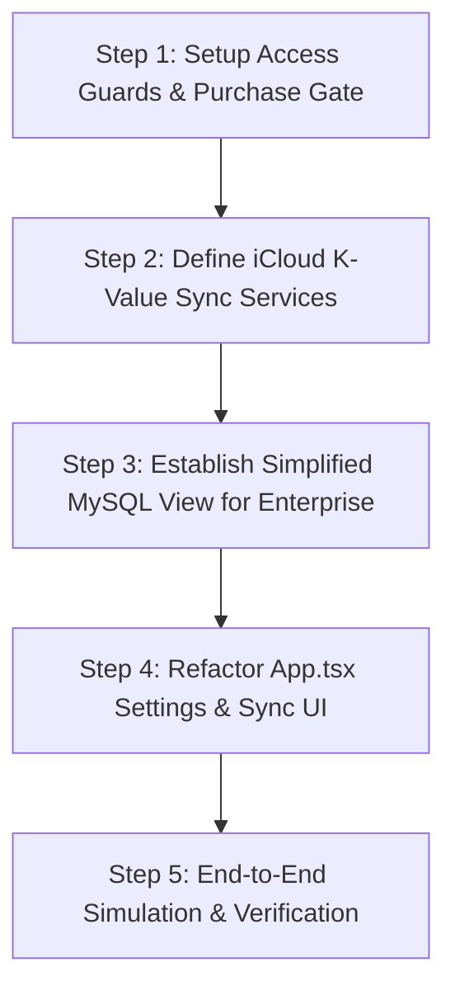

# 📋 Master Execution Plan: Dual-Sync & Access Gating (Triage Lite)

This master plan outlines the exact step-by-step coding roadmap to implement the **Dual-Sync & Access Gating system** inside the Triage Lite application, satisfying all premium monetization and sync specifications.

---

## 🗺️ High-Level Implementation Steps

### 1. 🛡️ Step 1: Establish Strict Access Guards & StoreKit Purchase Check
* **Objective:** Block any guest, trial, or anonymous Triage users from accessing the app. Users must pass purchase validation to enter.
* **Coding Work:**
  * Add a startup `purchaseVerified` state hook (`const [isPurchased, setIsPurchased] = useState<boolean | null>(null);`).
  * On mount, invoke native StoreKit receipt validation (mocked cleanly in development mode with local persistence, but wired to `Capacitor` billing APIs).
  * If validation fails, render a full-screen premium brutalist lock screen asking the user to complete their App Store purchase, disabling all background board interactivity.

### 2. 🍏 Step 2: Implement Apple Cloud (iCloud) Key-Value Sync Layer
* **Objective:** Allow standalone purchasers (who do not have a Triage Enterprise account) to automatically synchronize their task lists, focus history, and habits across multiple iOS/macOS devices.
* **Coding Work:**
  * Build a native hook integration inside `useCapacitor.ts` that safely binds to `window.Capacitor.Plugins.iCloudKV`.
  * Create a background sync thread in `App.tsx` that automatically pushes local state changes to the secure iCloud container on mutation (LWW - Last Write Wins strategy).
  * On app launch, query the iCloud container to load and merge external device edits seamlessly.

### 3. 🗄️ Step 3: Implement Simplified MySQL Sync for Enterprise Users
* **Objective:** Allow Triage Enterprise account holders (who also purchase the Lite app) to view their databases in a simplified format with mild edit capabilities.
* **Coding Work:**
  * Create REST adapters in `triage-lite/src/data/services/` that connect to `/api/alphav1/cards`.
  * Toggle the client rendering state if `isConnected === true`:
    * Render a sleek, simplified day-planner list view showing core board columns vertically or side-by-side.
    * Constrain card editing inside the Brutalist detail modal to only permitted fields (e.g., changing due date, updating task state, adding completion comments).

### 4. ⚙️ Step 4: Refactor App.tsx Settings & Synchronize Console
* **Objective:** Provide visual and functional control over sync status.
* **Coding Work:**
  * Design a new Settings pane section displaying either:
    * **"Apple iCloud Backup & Sync Active"** (for standalone users).
    * **"Triage Enterprise SQL Sync Active"** (for connected account holders).
  * Remove any deprecated local guest backup options or CSV-only constraints.

### 5. 🧪 Step 5: Dual-Path Verification & Testing
* **Objective:** Empirically validate the dual path.
* **Testing Routine:**
  * Test standalone mode offline/online to ensure iCloud key-value updates serialize smoothly.
  * Test enterprise mode to ensure `PATCH` and `PUT` request bodies do not trigger backend validation errors or MySQL constraint exceptions.

---

## 📅 Scheduled Timeline & Execution Strategy

* **Execution Mode:** Atomic step-by-step.
* **Verification Gating:** After each step is completed, we run build checks and ask the user for confirmation before progressing to the next step.

> [!IMPORTANT]
> **Operational Constraint Check:**
> * Prior to editing any codebase files, the Gemini CLI must obtain an explicit **"YES"** or **"PROCEED"** from the user.
