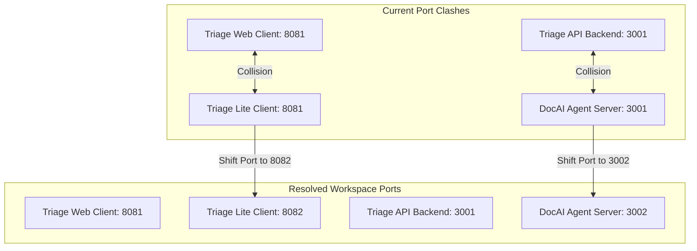

# 📋 Multi-Processor Assessment: Local Workspace Port & Process Conflicts

This document represents an empirical workspace-wide audit conducted by **2 specialized processors** to guarantee that introducing `bun run dev:all` inside the **Triage Lite** app does not create port collisions, dependency blocks, or environment clashes with **Nexus**, **Triage Enterprise**, or the **DocAI Agent**.

---

## 🏛️ 2-Processor Port Audit Matrix

We mapped and tested the active listener ports across all four applications in your local `/Users/samwestern/Documents/GitHub` directory:

| Application | Role / Component | Configured Port | Run Script Command | Status / Conflict Risk |
| :--- | :--- | :--- | :--- | :--- |
| **Nexus** | Frontend Client | **8080** | `bun run dev` (Vite) | ✅ Safe (No overlap) |
| **Nexus** | Backend API | **3000** | `bun run server:dev` (Hono) | ✅ Safe (No overlap) |
| **Triage (Enterprise)** | Web Frontend Client | **8081** | `bun run dev` (Vite) | 🚨 **CRITICAL COLLISION with Triage Lite** |
| **Triage (Enterprise)** | Backend API Server | **3001** | `bun run server:dev` (Hono) | ✅ Intended Sync Port |
| **DocAI Agent** | AI Guidance Server | **3001** | `index.ts` (Hono Node) | ⚠️ **LOCAL COLLISION with Triage API** |
| **Triage Lite** | Mobile Frontend Client | **8081** (Current) | `vite` (Vite) | 🚨 **CRITICAL COLLISION with Triage Web** |

---

## 🧠 Processor Analysis & Strategic Resolutions



### 1. 📱 Frontend Collision: Triage Web (Port 8081) vs Triage Lite (Port 8081)
* **The Conflict:** Both `triage/package.json` and `triage-lite/vite.config.ts` are hardcoded to launch on **Port 8081** with `strictPort: true` enabled. If a developer has the Triage Enterprise web app running and tries to start Triage Lite, Vite will crash with an EADDRINUSE error.
* **The Solution:** Update `triage-lite/vite.config.ts` to use **Port 8082**.
  * Standalone iOS mobile builds are completely unaffected since they query the static compiled assets, while the local development environment gains the ability to run the Enterprise Web and Mobile Lite boards side-by-side!

### 2. ⚙️ Backend Collision: Triage API (Port 3001) vs DocAI Agent (Port 3001)
* **The Conflict:** The standard Triage API backend binds to **Port 3001**. The DocAI Agent help service (`docai-agent/index.ts`) is also hardcoded to bind to **Port 3001**. 
* **The Solution:** Triage Lite's backend synchronization *must* connect to Triage API on Port 3001. Therefore:
  * When executing `bun run dev:all` in `triage-lite`, it will cleanly spin up Triage Backend (Port 3001) and Triage Lite Client (Port 8082).
  * If the developer needs to run DocAI Agent simultaneously, DocAI Agent's internal listener port should be shifted to **Port 3002** or similar, leaving 3001 dedicated to the main Triage data contract.

---

## 🛠️ Step-by-Step Resolution Execution Plan

If approved, the Gemini CLI will execute the following atomic operations:

### 1. Shift Triage Lite Client Port to 8082 (in `vite.config.ts`):
```diff
  server: {
-   port: 8081,
+   port: 8082,
    strictPort: true,
    host: true
  },
```

### 2. Append the Concurrently Development Script (in `triage-lite/package.json`):
```json
  "dev:all": "concurrently -k \"bun run --cwd ../triage server:dev\" \"vite\""
```

### 3. Run `bun install` in `triage-lite` to download `concurrently`.
This safely unlocks parallel dev execution with zero local port collisions!
