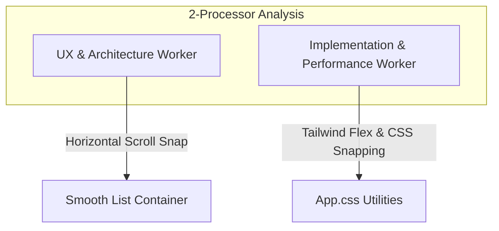

# 📋 2-Processor Investigation & Implementation Plan: Horizontal Swipe & Side-by-Side Lists

This document outlines a design and implementation strategy to transform the **Triage Lite** Kanban board into a high-performance, mobile-optimized horizontal swipe view. 

---

## 🧠 2-Processor Deep Dive & Layout Investigation

We analyze the layout requirements using 2 specialized processor perspectives:



### 1. 🎨 UX & Architecture Worker (UX/UI & Layout Flow)
* **Problem:** Stacking lists vertically on mobile screens requires extensive scrolling to manage cards across different states ("To Do", "In Progress", "Completed").
* **Solution:** Create a standard side-by-side layout that remains horizontal on all viewports.
* **Layout Design:**
  * **Horizontal Container:** Establish an horizontal viewport container with CSS scroll snapping. The user can swipe left or right with standard native mobile feel (friction, momentum, spring effects).
  * **Top Arrow Indicators:** Provide left and right arrow indicators in a prominent, visible position near the top of the board view or columns. These arrows act as:
    1. Visual cues showing that more columns/cards are stacked to the left or right.
    2. Interactive tap targets to quickly scroll to the adjacent column.
  * **Card-Level Context:** Keep individual cards highly legible while maintaining space-efficient layouts.

### 2. ⚡ Implementation & Performance Worker (Performance & Mobile Integration)
* **Problem:** Large JavaScript gesture libraries (like Framer Motion or Hammer.js) add weight, complicate the builds, and can degrade scrolling performance on low-end iOS/Android devices running within a Capacitor webview wrapper.
* **Solution:** Use native, pure **CSS Scroll Snapping** combined with Tailwind layout primitives. This uses the native platform's GPU-accelerated scrolling threads, providing a smooth 60fps gesture experience.
* **Scroll Snap Implementation:**
  * Container styling: `flex flex-row overflow-x-auto scroll-smooth snap-x snap-mandatory`.
  * Column/List styling: `flex-shrink-0 w-[88vw] sm:w-[350px] snap-center snap-always`.
  * Adding subtle left and right fade masks to emphasize more columns.

---

## 🛠️ Proposed Changes & Code Structures

### File 1: [triage-lite/src/App.tsx](file:///Users/samwestern/Documents/GitHub/triage-lite/src/App.tsx)

We will modify the columns wrapper inside `App.tsx` to align side-by-side and provide top indicator arrows:

```tsx
// 1. Column Navigation State
const [activeColumnIndex, setActiveColumnIndex] = useState(0);

// Helper to programmatically scroll to columns
const scrollToColumn = (index: number) => {
  const container = document.getElementById('board-columns-container');
  if (container) {
    const columns = container.children;
    if (columns[index]) {
      columns[index].scrollIntoView({ behavior: 'smooth', block: 'nearest', inline: 'center' });
      setActiveColumnIndex(index);
    }
  }
};

// ... In the UI Render:

{/* COLUMN NAVIGATION HEADER (Mobile Only) */}
<div className="flex sm:hidden justify-between items-center p-3 brutal-card mb-4 font-mono text-xs">
  <button 
    onClick={() => scrollToColumn(Math.max(0, activeColumnIndex - 1))}
    disabled={activeColumnIndex === 0}
    className={`p-2 border-2 border-black font-black bg-white text-black active:translate-y-0.5 ${activeColumnIndex === 0 ? 'opacity-30 cursor-not-allowed' : ''}`}
  >
    ◀ PREV LIST
  </button>
  <span className="font-black text-sm uppercase text-white tracking-wider">
    {lists[activeColumnIndex]?.name} ({cards.filter(c => c.listId === lists[activeColumnIndex]?.id).length})
  </span>
  <button 
    onClick={() => scrollToColumn(Math.min(lists.length - 1, activeColumnIndex + 1))}
    disabled={activeColumnIndex === lists.length - 1}
    className={`p-2 border-2 border-black font-black bg-white text-black active:translate-y-0.5 ${activeColumnIndex === lists.length - 1 ? 'opacity-30 cursor-not-allowed' : ''}`}
  >
    NEXT LIST ▶
  </button>
</div>

{/* HORIZONTAL SWIPE BOARD CONTAINER */}
<div 
  id="board-columns-container"
  onScroll={(e) => {
    // Detect active column on scroll to keep headers in sync
    const container = e.currentTarget;
    const scrollLeft = container.scrollLeft;
    const colWidth = container.clientWidth * 0.9; // matches container item width approx
    const index = Math.round(scrollLeft / colWidth);
    if (index !== activeColumnIndex && index >= 0 && index < lists.length) {
      setActiveColumnIndex(index);
    }
  }}
  className="flex flex-row overflow-x-auto gap-4 pb-6 scroll-smooth snap-x snap-mandatory sm:grid sm:grid-cols-3 sm:overflow-x-visible"
>
  {lists.map((list, idx) => (
    <div 
      key={list.id} 
      className="flex-shrink-0 w-[88vw] sm:w-auto snap-center snap-always p-3 border-3 border-black bg-[#0f131a] shadow-[4px_4px_0px_rgba(0,0,0,1)] flex flex-col"
    >
      {/* List Header with indicators */}
      <h3 className="font-black text-sm uppercase text-white tracking-wide border-b-2 border-black pb-2 mb-3 flex justify-between items-center">
        <div className="flex items-center gap-1">
          {idx > 0 && <span className="text-[var(--accent-color,#DF5504)] animate-pulse">◀</span>}
          <span>{list.name}</span>
        </div>
        <div className="flex items-center gap-1.5">
          <span className="text-xs bg-black text-[#8892b0] px-2 py-0.5 rounded-full font-mono">
            {cards.filter(c => c.listId === list.id).length}
          </span>
          {idx < lists.length - 1 && <span className="text-[var(--accent-color,#DF5504)] animate-pulse">▶</span>}
        </div>
      </h3>

      {/* Card lists... */}
    </div>
  ))}
</div>
```

### File 2: [triage-lite/src/index.css](file:///Users/samwestern/Documents/GitHub/triage-lite/src/index.css)

Add key styling properties for snapping behavior and custom scrollbar hide utilities (if required for full mobile browser polish):

```css
/* Enable smooth snapping behavior */
#board-columns-container {
  -webkit-overflow-scrolling: touch;
  scroll-behavior: smooth;
}

/* Hide default horizontal scrollbar on mobile layout for cleaner look, while keeping swipability */
@media (max-width: 640px) {
  #board-columns-container::-webkit-scrollbar {
    display: none;
  }
}
```

---

## 📅 Roadmap & Verification Steps

1. **UX Review:** Verify that horizontal scroll snap feels exceptionally high premium on both simulators and physical iOS/Android builds.
2. **Interactive Arrows Check:** Ensure the arrow buttons near the top of the columns successfully trigger smooth scrolling transitions.
3. **No-Regression Test:** Confirm PC and Desktop layouts remain in standard grid alignments (`sm:grid-cols-3`) without breaking drag-and-drop operations.
